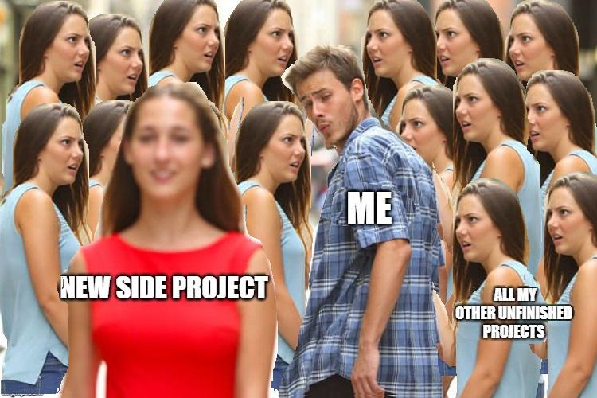

### 👋 Привет! Я Александра! 
<h3 align="center">Наглухо отбитая разработчица самоучка</h3>

🔹 **Чем я занимаюсь?**  
- 🎨 GameDev
- 💻 System Administration
- 🎭 LLM & Transformers

🔹 **Мои навыки:**  

                 

🔹 **Статистика GitHub:**  

🔹 **Последний мем-проект:**  

